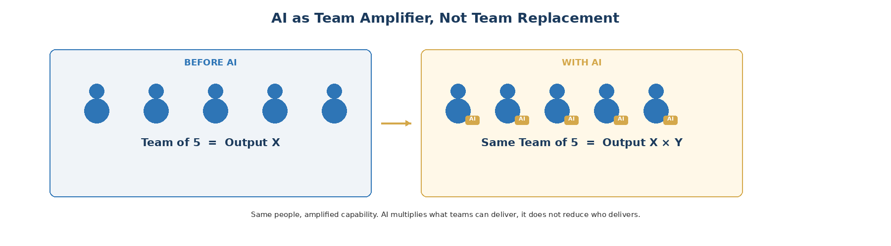

# 2. AI Is Joining the Team

Simultaneously, and independently of Scrum's dysfunction, a fundamental change is happening in how software teams work. AI is becoming a team member, not just a tool. This is not a prediction about the future. It is a description of the present.

The forms this takes vary widely. Some teams use AI coding assistants like GitHub Copilot, Cursor, or Windsurf as intelligent autocomplete that accelerates individual developers. Some use agentic tools like Claude Code, Kiro, or autonomous coding agents that can take a task description and produce working code with minimal human guidance. Some use AI through embedded features in their existing tools: CI/CD systems that auto-generate tests, code review tools that flag issues, documentation generators, and monitoring systems that suggest fixes. Some are building custom AI agents that participate in their specific workflows.

The specific tool matters less than the pattern. In all of these cases, a significant portion of what used to be human-exclusive work -- writing code, writing tests, writing documentation, debugging, and even some design decisions -- is now shared between humans and AI systems. The AI is not replacing the humans. It is joining them. And that changes the coordination model.

Scrum was designed to coordinate teams of humans. Its ceremonies, roles, and artifacts all assume that the people in the room are the ones doing the work, and that the primary challenge is aligning their efforts, managing their capacity, and creating space for them to do their best work. When AI handles a growing share of implementation, those assumptions weaken. The primary challenge shifts from coordinating human labor to coordinating human judgment: what to build, how to specify it precisely enough for AI to execute well, and how to validate that the output is correct and safe.

The result is that the same team delivers dramatically more. A team of five engineers that previously shipped X now ships X multiplied by an AI-amplification factor. This is not about replacing people. It is about each person becoming capable of more, with AI handling the mechanical work while humans focus on the judgment work. This amplified capacity needs a coordination model that matches: one that can handle higher throughput of decisions, specifications, and reviews without drowning in ceremony designed for a slower pace.

Dandori is designed for this convergence. It does not assume that all work is AI-executed. It does not assume any specific AI tool or capability level. It assumes that software teams will increasingly include AI as a participant in one form or another, whether as an independent agent, an embedded assistant, a custom automation, or any tool that leverages AI capabilities. The same team that delivered X before AI can now deliver X multiplied, and the coordination model needs to account for this amplified capacity.
