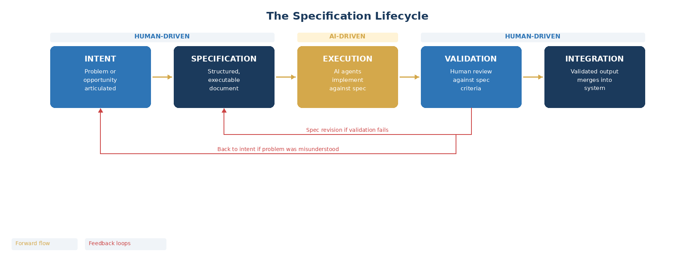

# 10. The Specification Lifecycle

Instead of Scrum's sprint cycle, Dandori follows the lifecycle of a specification through five stages. These are not phases in a waterfall sense; multiple specs move through them concurrently, and the flow is continuous.

| Stage | Purpose | Output |
|-------|---------|--------|
| **Intent** | Articulate the problem or opportunity in plain language with enough business context to reason about constraints. | A clear statement of what needs to change and why, with measurable success criteria and explicit constraints. |
| **Specification** | Formalize intent into a structured, executable document precise enough for AI agents to implement against. | Requirements in structured notation, architectural decisions, interface contracts, constraints, and testable acceptance criteria. |
| **Execution** | AI agents implement against the spec. Human role is minimal and supervisory. | Working code, tests, and documentation generated by AI agents following the specification. |
| **Validation** | Human review of AI output against the spec's acceptance criteria and broader system coherence. | Approved output ready for integration, or feedback that cycles back to the Specification or Intent stage. |
| **Integration** | Validated output merges into the system. The spec repository updates so future specs can reference prior decisions. | Shipped feature with living documentation. The spec becomes a permanent record of design decisions. |

The critical discipline is that if execution produces unexpected results, the team goes back to the specification, not to the code. The instruction gets fixed, not the output. This inverts the Scrum-era instinct of debugging code and replaces it with debugging specifications.
