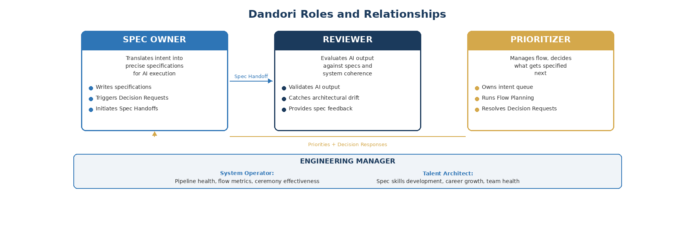

# 11. Roles

Three roles replace Scrum's Scrum Master, Product Owner, and Developer triad.

## Spec Owner

The Spec Owner combines product thinking with technical precision. This person translates business intent into specifications that AI can execute without ambiguity. They do not write code; they write the instructions that produce code. This role requires both domain expertise and an understanding of what AI agents can and cannot do well, a new and genuinely scarce skill. In most organizations, this maps to senior engineers or tech leads.

## Reviewer

The Reviewer is the quality gate. They evaluate AI output against specs and against broader system coherence. They catch the things specs cannot fully express: architectural consistency, performance implications, security concerns, edge cases the specification did not anticipate. The review discipline changes in Dandori because evaluating AI-generated code has different failure patterns than evaluating human-written code. AI code tends to be locally correct but globally inconsistent; it solves the specified problem but may not respect unwritten system conventions.

## Prioritizer

The Prioritizer replaces the Product Owner and Scrum Master combined. They manage the flow of specs through the pipeline, decide what gets specified next, and ensure the team is not optimizing locally while missing the bigger picture. This is a leadership function shared between the engineering lead and the product manager. The engineering lead owns technical sequencing and dependency management. The product manager owns business priority and success criteria. They negotiate continuously at the Intent stage, before specs are written, rather than in batch planning sessions.

| Dimension | Scrum | Dandori | Key Shift |
|-----------|-------|---------|-----------|
| Unit of work | User story | Specification | From intent description to execution instruction |
| Scarce resource | Developer time | Human judgment | From labor allocation to thinking amplification |
| Time model | Fixed sprints | Adaptive flow (sprints optional) | From rigid timebox to adaptive cadence |
| Estimation | Story points | Specifiability classification | From effort prediction to complexity triage |
| Primary metric | Velocity | Flow efficiency | From throughput of labor to throughput of judgment |
| Team size | 5-9 mixed seniority | Same team, amplified output | From skill coverage to judgment + AI collaboration |
| Coordination | Scrum Master | System Operator (EM) | From process facilitation to pipeline optimization |

## How Roles Evolve

A common misconception is that AI-augmented development eliminates the need for junior engineers or demands that all team members be senior. The reality is more nuanced and more interesting.

The need for junior engineers remains. Every team needs people who are learning, growing, and bringing fresh perspectives. What changes is what "junior" means. A junior engineer in Dandori is not someone who writes simple code under supervision. They are someone who is learning to write precise specifications, developing judgment about what AI output to trust and what to question, and building the domain knowledge that makes specifications accurate. These are learnable skills, and junior engineers bring something valuable to the learning process: they ask the questions that reveal assumptions seniors have stopped noticing.

Equally important is the recognition that many senior engineers are, in a real sense, junior again. An engineer with fifteen years of experience writing code is a beginner at writing specifications for AI execution. They are a beginner at reviewing AI-generated code, which has different failure patterns than human-written code. They are a beginner at collaborating with AI agents effectively. The seniority that matters in Dandori -- the ability to specify precisely, review critically, and make architectural decisions in an AI-augmented context -- is new enough that almost everyone is still developing it.

This is healthy. It levels the playing field in a way that creates opportunity rather than threat. It means that career growth is available to everyone on the team, not just those climbing a traditional coding ladder. And it means that the team's collective capability grows as everyone, junior and senior alike, gets better at the skills that Dandori values: thinking clearly, specifying precisely, and judging wisely.
