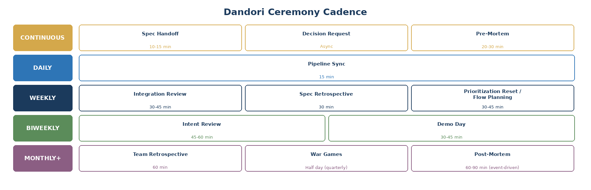

# 15. Ceremonies

Every ceremony in Dandori must earn its place by addressing a specific failure mode. If it does not prevent a real problem, it is waste.

## Ceremony Classification

Not every ceremony is mandatory at all times. Teams should start with all ceremonies active and earn the right to reduce frequency or omit based on data.

| Tier | Ceremony | When Reducible | What Breaks Without It |
|------|----------|----------------|----------------------|
| **Non-Negotiable** | Pipeline Sync | Never | Specs pile up unnoticed. Flow stops. |
| | Spec Handoff | Never | Reviewers misunderstand intent. |
| | Integration Review | Can shorten to 30 min | Architectural drift goes undetected. |
| **Required, Frequency Adapts** | Spec Retrospective | Biweekly when first-pass >75% | Spec quality stops improving. |
| | Prioritization Reset | Biweekly when queue is stable | Queue becomes stale. |
| **Conditionally Required** | Pre-Mortem | Only Complex/Uncertain specs | High-risk specs enter execution with unexamined assumptions. |
| | Decision Request | Triggered by need | Specs encode wrong decisions. |
| | Intent Review | Pause when team is small, domain is well-understood | Shared context degrades. |
| **Earned Optional** | Team Retrospective | Quarterly after 6 months stable | Human side goes unprocessed. |
| | Demo Day | Monthly or pause during low-output | Human contribution becomes invisible. |
| | War Games | Semiannual for stable systems | Systemic interaction risks undetected. |
| **Event-Driven** | Post-Mortem | Cannot omit when triggered | Root causes go unexamined. |

**Principle: start with everything, reduce based on evidence.** Dropping a ceremony because "we're too busy" is avoidance. Dropping it because your metrics justify it is earned confidence.

## Continuous Ceremonies

**Spec Handoff** (10-15 min per spec): Spec Owner walks the Reviewer through the spec before AI execution begins. Prevents the most expensive failure: correct AI execution of a misunderstood spec.

**Decision Request** (async, 4-24hr SLA): Structured request when a Spec Owner hits ambiguity. Format: what decision is needed, options, recommendation, what is blocked.

**Pre-Mortem** (20-30 min, high-risk specs): Team assumes AI executes the spec perfectly and asks what could still go wrong.

## Daily Ceremony

**Pipeline Sync** (15 min): Tracks specifications, not people. What moved forward, what is stuck, where is the highest-priority unblocked work.

## Weekly Ceremonies

**Integration Review** (30-45 min): What shipped, what patterns emerge in spec success and failure, architectural coherence check.

**Spec Retrospective** (30 min): How do we write better specs? Categorize failures, identify actionable improvements.

**Prioritization Reset / Flow Planning** (30-45 min): Re-rank intent queue, assess capacity, triage new intents with Specifiability Classification.

## Biweekly, Monthly, Periodic, and Event-Driven

**Intent Review** (45-60 min, biweekly): Full team reviews upcoming intents for shared context-building.

**Team Retrospective** (60 min, monthly): The human-centered ceremony addressing feelings, identity, and sustainability.

**Demo Day** (30-45 min, biweekly/monthly): Cultural ceremony showcasing the spec-to-outcome journey.

**War Games** (half day, quarterly): Stress-test systemic interactions between independently correct specs.

**Post-Mortem** (60-90 min, event-driven): Root cause analysis explicitly asking: was this a spec failure, AI execution failure, validation failure, or operational failure?
