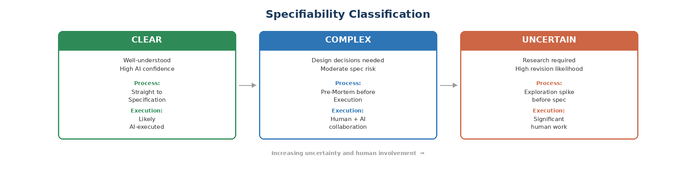

# 16. What Dandori Transforms

Most teams operate in a hybrid reality. The following Scrum practices are not eliminated. They are transformed.

## Sprints Become Optional and Adaptive

Dandori does not mandate dropping sprints. The framework supports the full spectrum from strict sprints through loose timeboxes to pure flow. Teams should move along that spectrum based on data, not ideology.

## Sprint Planning Becomes Flow Planning

The capacity question transforms from "how many story points?" to "how many specs can we write, execute, and validate, given that some work requires significant human involvement?"

## Backlog Grooming Becomes Intent Review

A broader team ceremony focused on context-building, not estimation. The team asks: do we understand this problem well enough that any of us could write a spec or review AI output for it?

## Story Points Become Specifiability Assessment

A three-tier classification replaces story points:

| Classification | Definition | Process Implication |
|---------------|------------|-------------------|
| **Clear** | Well-understood, high AI confidence | Straight to Specification. Likely AI-executed. |
| **Complex** | Design decisions needed, moderate risk | Pre-Mortem before Execution. Human + AI collaboration. |
| **Uncertain** | Research required, high revision likelihood | Exploration spike before spec. Significant human work. |

## Velocity Becomes Flow Metrics

Formal velocity tracking is replaced by a richer set of flow and quality metrics detailed in Chapter 17.

## The Scrum Master Role Dissolves into the System Operator

The coordination function dissolves into the EM's System Operator role. Teams in early adoption may benefit from someone explicitly owning the transition.
